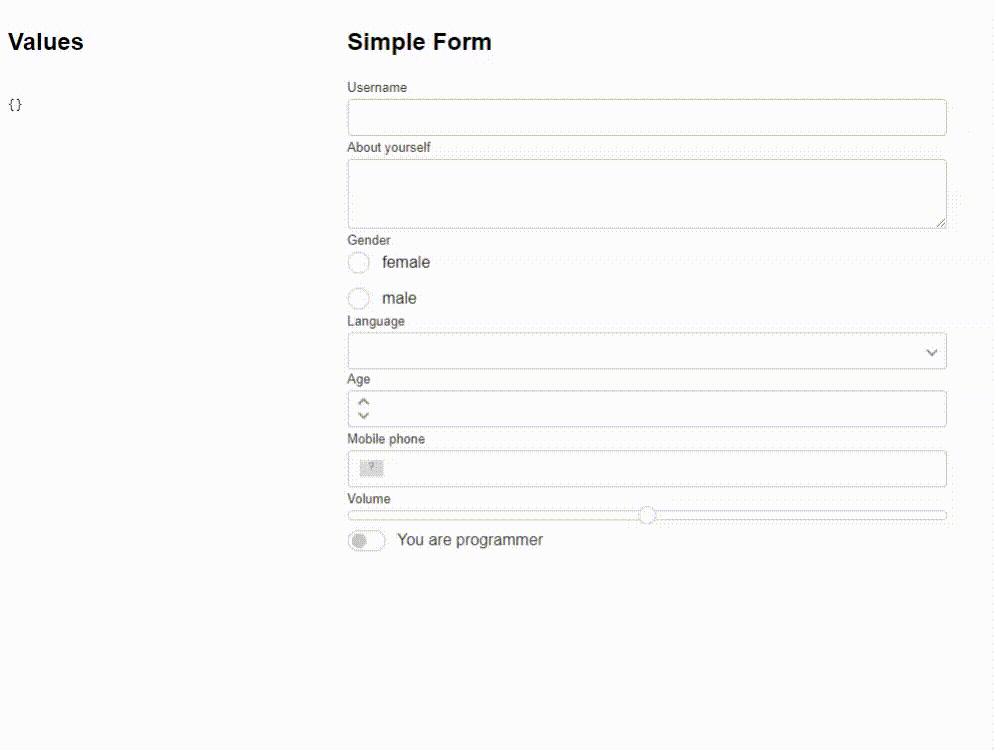

# Jenesius Vue Form
Heavy form system for Vue.js ( **Only 3 Version** ). Library provides a wide range of
functionality and interaction with form elements.

## Links
- [Documentation](https://form.jenesius.com/)
- [Examples](https://form.jenesius.com/examples/list.html)
- [GitHub](https://github.com/Jenesius/vue-form)
## Reason For Use


- 💪 The functionality of the form allows you to flexibly work with dependent elements.
- 🤝 Create complex interfaces with lots of dependencies. One page can contain many
forms that will be managed from one place.
- ✍ Connect your own input fields to the form. This gives flexibility and
independence on the part of the site design.

*Where the spirit does not work with the hand there is no art.* @Leonardo da Vinci



## Usage
This example demonstrates a simple use of this library using the login form as an example.

```vue
<template>
  <input-field name = "login"/>
  <input-field name = "password" type = "password"/>
  <button @click = "handleLogin">Login</button>
</template>
<script setup>
import {InputField, Form} from "jenesius-vue-form";

const form = new Form();
function handleLogin() {
  console.log(form.values)  // { login: "", password: "" }
}
</script>
```

## Main Form
To create a form, you just need to create an instance. JenesiusVueForm will do
most of the work for you.
```ts
import {Form} from "jenesius-vue-form"
const form = new Form()
```

### Main Form state
The reactive form state can be obtained from the **useFormState** hook, and reactive values from 
**useFormValues**:
```js
import {useFormState, useFormValues} from "jenesius-vue-form"
const state = useFormState(form) // disabled changed
const state = useFormValues(form) // disabled changed
```

## Proxy Form
You can flexibly create complex inputs (compound) using FormProxy.
[More Information](https://github.com/Jenesius/vue-form/tree/main/examples/form-proxy)


## Example
The current example shows the simplest binding of two fields to a form and working with them
```vue
<template>
    <input-field name = "username"/>
    <input-field name = "password" type = "password"/>
    
    <button @click = "showValues">values</button>
    <button @click = "setUsername">set default name</button>
</template>
<script setup >
    import {Form, InputField} from "jenesius-vue-form"
    const form = new Form();
	
    // Getting values from Form
    function showValues() {
        console.log(form.values);
    }
	// Setting username
    function setUsername() {
        form.change({
            username: 'Jack'
        })
    }
</script>
```

## Full Functionality
I recommend going to the [documentation site](http://form.jenesius.com/),
which provides information on 
validation, form lock/unlock, and all the states of the form and input fields.
