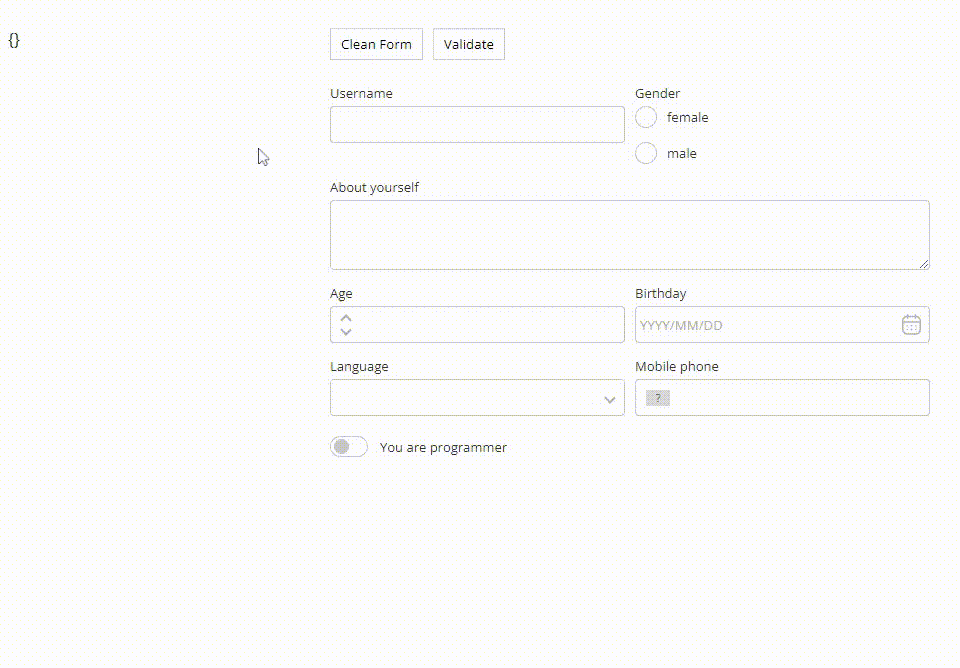

<p align="center"><a href="https://form.jenesius.com/" target="_blank" rel="noopener noreferrer"></a></p>

<p align="center">
  <a href="https://img.shields.io/npm/dm/jenesius-vue-form"></a>
  <a href="https://img.shields.io/npm/dt/jenesius-vue-form"></a>
  <a href="https://github.com/Jenesius/vue-form/actions/workflows/node.js.yml/badge.svg"></a>
  <a href="https://img.shields.io/github/issues/Jenesius/vue-form"></a>
  <a href="https://img.shields.io/github/stars/Jenesius/vue-form"></a>
</p>

# Jenesius Vue Form
Powerful system for working with forms and inputs. The deep library integrates with Vue (**3 version only**) and provides a large set of tools for working with forms.

## Documentation

To check out [live examples](https://form.jenesius.com/examples/list.html) and docs, visit [form.jenesius.com](https://form.jenesius.com/).

## Integration with other UI libraries

This section is described in this part of the [documentation](https://form.jenesius.com/guide/third-party-libraries.html)

## Questions and Issues

For questions and support please use [the GitHub repo](https://github.com/Jenesius/vue-form).

## Quick Example



## Usage
This example demonstrates a simple use of this library using the login form as an example.

```vue
<template>
    <form-field name = "login"/>
    <form-field name = "password" type = "password"/>
    <button @click = "handleLogin">Login</button>
</template>

<script setup>
import {FormField, Form} from "jenesius-vue-form";

const form = new Form();
function handleLogin() {
    console.log(form.values)  // { login: "", password: "" }
}
</script>
```

We connected two fields (login, password), arranged the corresponding types of provided libraries, industrial-level instances.
a form and creating a handler for entering which takes on the value of the form. This is an example of the simplest form of use.

## License

[MIT](https://opensource.org/licenses/MIT)

Copyright (c) 2022-present, Jenesius
